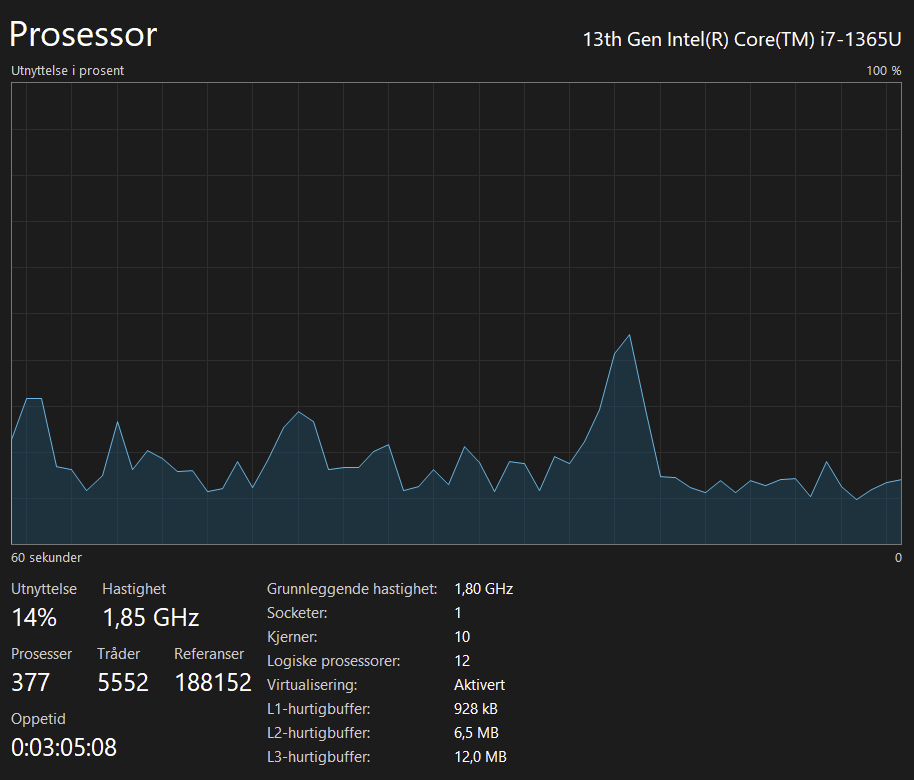

# Performance measurements  

This does just so happen to be relevant as this is designed to run for a LONG time if you wish to.  
I'll be taking measurements and denote the version I'm working with per measurement.  

These are the specs of the machine I'm testing on:

```plaintext
Microslop Windows 11 Enterprise 10.0.26200
Dell Latitude 7440
13th Gen Intel(R) Core(TM) i7-1365U, 1800 Mhz, 10 Core 
16GB RAM, 35GB Swap
Intel Iris Xe Integrated Graphics
256GB Samsung NVMe SSD PM9B1
```

## Endurance test 1  

Testing occurred over one weekend. Program was started and left running in the background.  
Total time: ~68 hours  
Active time: ~6 hours  
App version: 0.1.0  

One measurement was taken at the end of this time, before a restart to capture the initial state.  
Both measurement were taken using Process Hacker.  

|                  At 68 hours                |                 At 0 hours                |
|:-------------------------------------------:|:-----------------------------------------:|
|  |  |

The most noticable change is an increased memory usage - however this is not a significant change at this time and should be tested further before any conclusions are drawn.  
Also of note is a stable low CPU usage and generally low I/O and Memory usage.  

Looking at the log (8,72kB in this case); It has indeed not been running while the device was sleeping. A sharp cut appears from 24.04.2026 to 27.04.2026 - quite as expected.  
Regardless of the exceedingly expected limitations of OS inactivity, the cature seems accurate for all events occurring within the given timeframe, including detecting that the device was reactivated (in a sudden logging spree from the sudden change)  

Interestingly enough, it reveals when the applicable fileshares go offline, as a network disturbance seems to have occurred before the device initiated sleep.  

A new test with a device remaining active for 72 hours is recommended.  

## Timing test 1  

Testing occurred over 2 minutes and 35 seconds.  
App version: 0.1.0

The following was added to the top of `update_status()`:  

```cpp
std::cout << (int64_t)std::chrono::duration_cast<std::chrono::nanoseconds>(std::chrono::steady_clock::now().time_since_epoch()).count() << std::endl;
```

DDCL was then compiled and executed in a Cygwin terminal as follows:

```shell
cd <...>/dist
time ./ddcl.exe | grep -E "^[0-9]{14}.?$"
```

This effectively logs the exact time DDCL updates its data and how long the entire chain takes - this is subsequenty analyzed in a spreadsheet editor.  

Additionally, this load was placed on the device + 91% Memory use (14.0GB)  


`time` reported the following:

```plaintext
real    2m35.495s
user    0m0.062s
sys     0m0.453s
```

The data is logged in [timing_data.csv](./timing_data.csv)  

By my math we have the following numbers, excluding the first two rows:  

| Average in µs | Max spread in µs | Max spread in ms | Avg spread in µs | Avg spread in ms |
|:--------------|:-----------------|:-----------------|:-----------------|:-----------------|
| 1010895,126   | 15257            | 15,257           | 1666,35          | 1,66635          |

This i find decent. Please note that no disturbances such as network access loss or VPN status change ocurred during the test.
